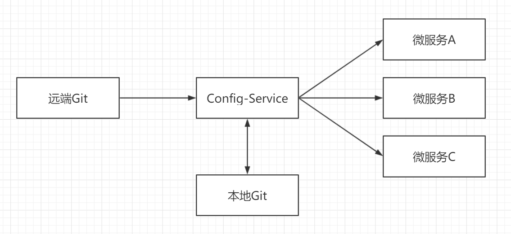

# SpringCloudConfig


#说明

---

- 该项目为 SpringCloudConfig 的脚手架工具，提供配置中心功能，该项目可以单实例启动，或者做高可用配置使用。
- 该项目下载后，可以直接用IDEA打开，如果是单实例启动，只要直接在 SpirngCloudConfigApplication.java 里面直接点击 main 启动即可 

---

# 注意
- 配置中心，只提供配置下载逻辑，所有，里面也不需要填充逻辑，直接跑起来即可，高可用只需要启动多个实例注册到同一个 Eureka 即可。

---

# 使用顺序
1. 检查 SringBoot 版本 和 SpringCloud 的版本是否和 Eureka 一致 

   * 本项目 SpringBoot 版本： 2.1.5.RELEASE 
   * 本项目 SpringCloud 版本： Greenwich.SR1
 
2. 启动 注册中心 (注册中心必须先启动) 
3. application.yml 配置文件配置你 git 配置仓库的位置
   
   ```yaml
   spring:
     application:
       name: config
     cloud:
       config:
         server:
           git:
             uri: https://github.com/MrXuan3168/Spring-Cloud-Config-Repo.git
             username: 1004108488@qq.com
             #password: xxxx(git仓库密码) #如果仓库是公开的，可以不配密码
   eureka:
     client:
       service-url:
         defaultZone: http://localhost:8761/eureka/,http://localhost:8762/eureka/,http://localhost:8763/eureka/  #注册到 Euraka
   server:
    port: 8090
   ```
4. 启动程序
5. 检查配置中心是否正常 假如 git仓库 上面有一个配置文件名为 eureka1-dev.yml
里面的内容为
```yaml
spring:
  application:
    name: eureka1
  datasource:
    driver-class-name: com.mysql.jdbc.Driver
    password: show
    url: jdbc:mysql://127.0.0.1:3306/showDB?characterEncoding=utf-8&useSSL=false
    username: root
  jpa:
    show-sql: true
```
访问地址为: http://localhost:8090/eureka1-dev.yml
看到有内容，说明成功。

---

# 配置中心原理说明

- 配置中心本质上是从网上的git仓库下载配置文件到本地。
```
2019-06-05 14:34:02.306  INFO 29440 --- [nio-8090-exec-1] o.s.c.c.s.e.NativeEnvironmentRepository  : Adding property source: file:/C:/Users/show/AppData/Local/Temp/config-repo-1965805280546469012/config-client-dev.yml
```
你会看到有该日志，证明就是从git上面下载到本地的，我们需要更新的时候，只需要改 Git仓库上的配置文件即可。

---

#其他微服务如何使用配置中心
 - 请查看 spring-cloud-server 项目说明
