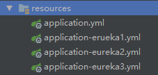
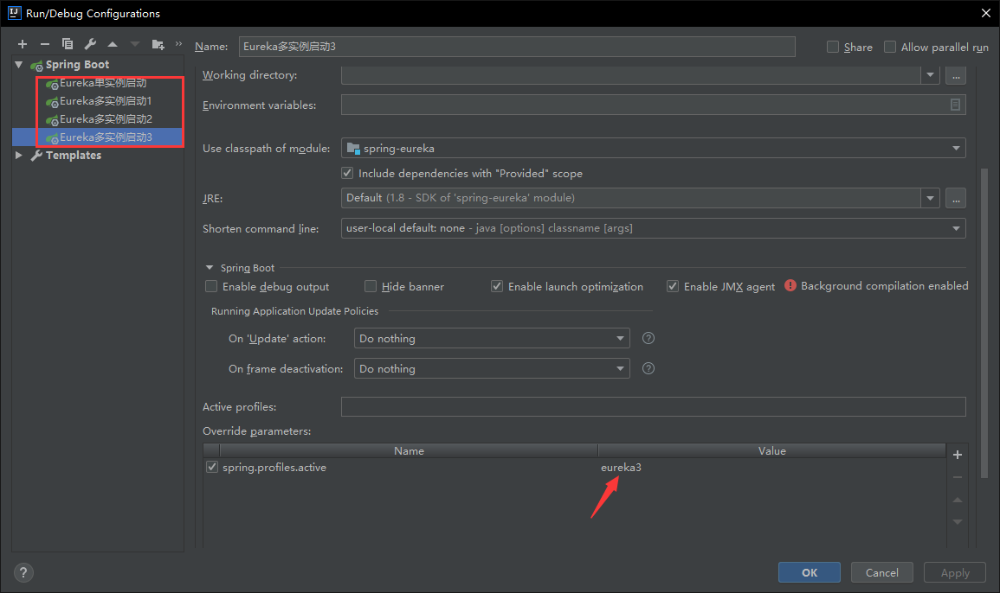

#说明
- 该项目为 Eureka 的脚手架工具，提供服务注册功能，该项目可以单实例启动，或者做高可用注册中心使用。
- 该项目下载后，可以直接用IDEA打开，如果是单实例启动，只要直接在 SpringEurekaApplication.java 里面直接点击 main 启动即可 
- 若是想实现高可用(多实例相互注册)，可以参考下面方式

--- 

###方式一
 
- 在Idea的启动配置里面指定配置文件，我分别为你们准备了3个配置文件用于多实例启动



- 左边添加几个启动实例，实例右边的 override parametrs 分别添加不同的启动配置。

---

配置如下：
```
/** 
   如果想自定义名字，可以把配置文件里面 eureka1 改成你想要的内容 
   例如 application-dev.xml
   这时你的启动配置为 spring.profiles.active=dev 
   */
   
spring.profiles.active=eureka1

spring.profiles.active=eureka2

spring.profiles.active=eureka3
```

---

### 方式二
- 把你的项目打成一个jar包，然后用命令的形式启动，启动命令为
```
# --spring.profiles.active 用来指定配置文件。
java -jar  .\target\eureka-1.0.0-SNAPSHOT.jar --spring.profiles.active=eureka3 
```

---

- Windows 的用户，可以写一个脚本一次性启动3个实例。
- 方法如下:
- 新建一个记事本内容为
```
# -jar 后面的内容为你 maven 打包后jar包的路径 
# --spring.profiles.active 用来指定配置文件。
# 喜欢 powershell 的同学可以把 cmd /k 替换成 powershell (win10建议用powershell)
start cmd /k "java -jar D:\Desktop\target\eureka-1.0.0-SNAPSHOT.jar --spring.profiles.active=eureka1"
start cmd /k "java -jar D:\Desktop\target\eureka-1.0.0-SNAPSHOT.jar --spring.profiles.active=eureka2"
start cmd /k "java -jar D:\Desktop\target\eureka-1.0.0-SNAPSHOT.jar --spring.profiles.active=eureka3"
```
 - 右击保存，然后把文件名后缀改成 .bat 结尾 如：startAllEureka.bat。
-  双击启动，就可以一次性把多个 eureka 启动了， mac 同理 。

---

# 注意 
## Eureka 只是一个注册中心，本身是不需要使用者添加业务逻辑的，只提供服务注册及发现功能，只需要启动让其他微服务可以注册即可。

---

